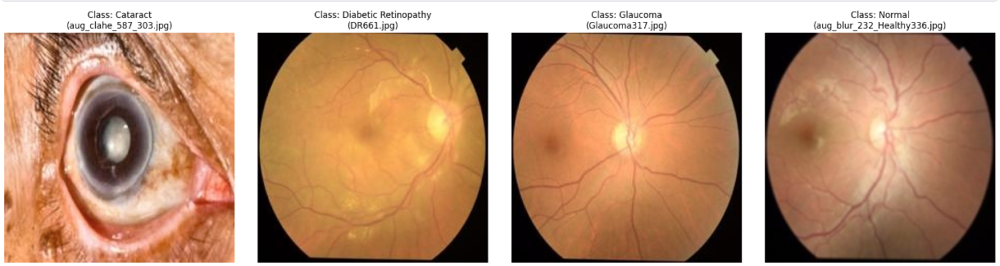
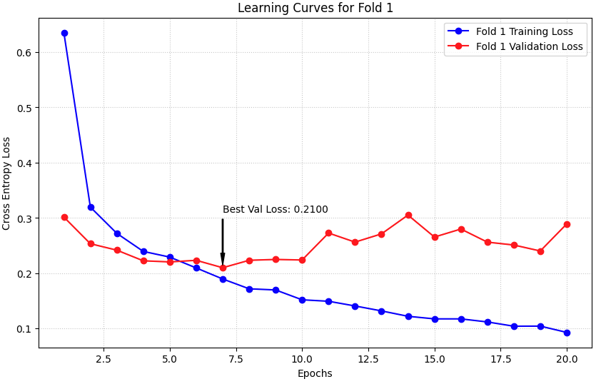

# Synergizing CNNs and Vision Transformers with Channel-Wise Attention for Enhanced High-Resolution Retinal Diagnostics

[](https://www.python.org/downloads/)
[](https://pytorch.org/)
[](https://opensource.org/licenses/MIT)

## 📌 Project Overview
This repository contains a state-of-the-art deep learning pipeline for the multi-class classification of retinal diseases using fundus photography. By integrating **EfficientNet-B0** (CNN) and **Swin Transformer** architectures with a custom **Squeeze-and-Excitation Attention mechanism**, the model achieves high-precision diagnostics across four categories: **Cataract, Diabetic Retinopathy, Glaucoma, and Normal.**

### 🔍 Key Features
* **Hybrid Architecture:** Combines local feature extraction (CNN) with global context modeling (Vision Transformer).
* **Squeeze-and-Excitation Attention:** A custom attention head designed to reduce inter-class confusion, particularly between Glaucoma and Normal eyes.
* **Medical Enhancement Pipeline:** Utilizes **CLAHE** (Contrast Limited Adaptive Histogram Equalization) and high-resolution ($384 \times 384$) processing.
* **Robust Evaluation:** Implemented using **5-Fold Cross-Validation** to ensure statistical reliability.

---

## 📸 Dataset Representation
The model is trained on a balanced dataset of retinal fundus images. Below are representative samples from each diagnostic class:


*Figure 1: Representative samples showing (left to right) Cataract, Diabetic Retinopathy, Glaucoma, and Normal retinal conditions.*

---

## 📈 Training Performance
The model demonstrates strong convergence and stability. Below is the learning curve for the first fold of our 5-fold cross-validation, showing the optimization of Cross-Entropy Loss over 20 epochs.


*Figure 2: Training vs. Validation Loss for Fold 1. The model achieves its best validation state at Epoch 7 with a loss of 0.2100.*

---

## 🛠️ Methodology

### 1. Preprocessing & Augmentation
To address the subtle vascular changes in Glaucoma, we implemented:
* **CLAHE:** To enhance the visibility of blood vessels and the optic disc.
* **Spatial Augmentation:** Random rotations, horizontal/vertical flips to prevent overfitting.
* **Resolution:** Upscaled to $384 \times 384$ to maintain high-fidelity details.

### 2. Architecture
The model uses a **Dual-Path Feature Fusion** approach:
* **Backbone:** EfficientNet-B0 / Swin-T.
* **Attention Head:** ```python
    # Squeeze-and-Excitation Logic
    self.attention = nn.Sequential(
        nn.Linear(in_features, in_features // 16),
        nn.ReLU(),
        nn.Linear(in_features // 16, in_features),
        nn.Sigmoid()
    )
    ```


## 📊 Results Summary
* **Cataract:** ~1.00 F1-Score
* **Diabetic Retinopathy:** ~0.98 F1-Score
* **Glaucoma/Normal:** Significant improvement in precision via Attention-Head weights.

---

## 👨‍🔬 Author
**[Chinedu Emmanuel Mbonu]** *Deep Learning Researcher / AI Developer*

---
